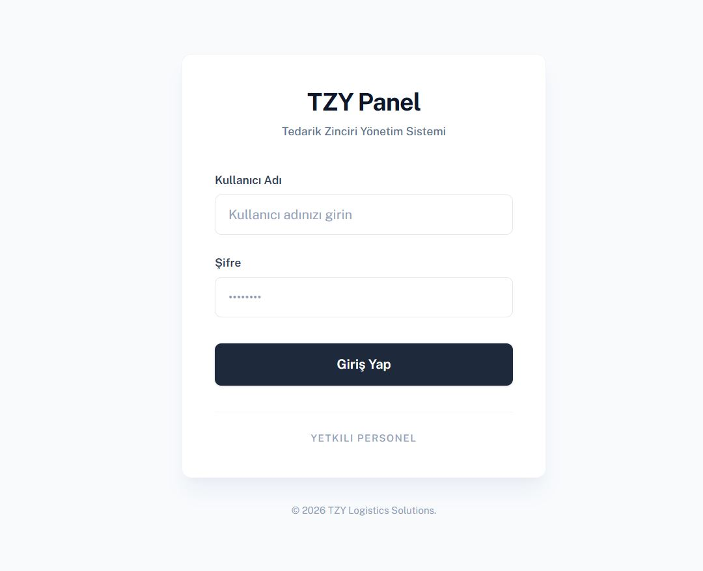
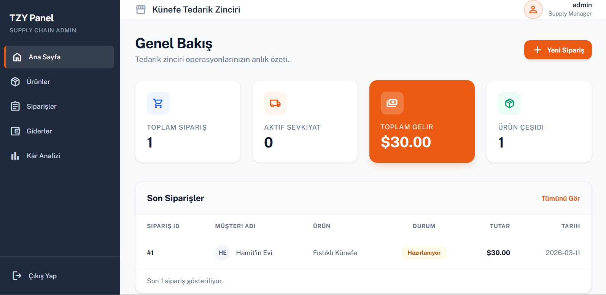
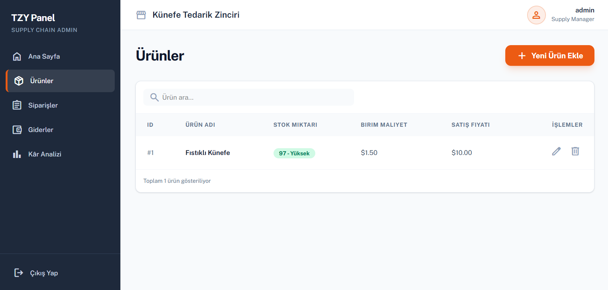
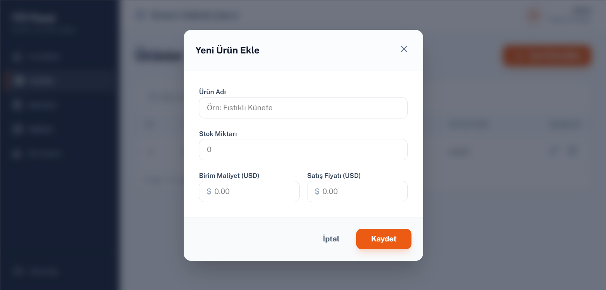
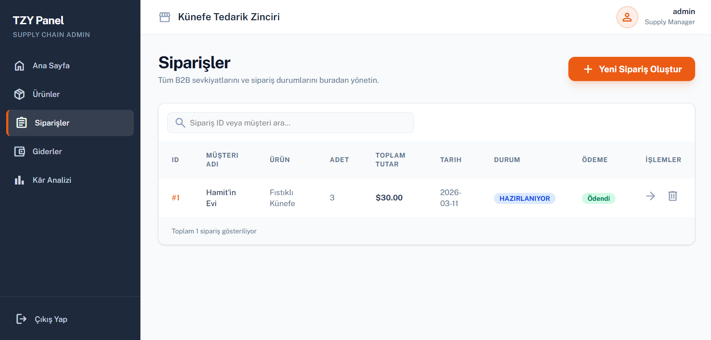
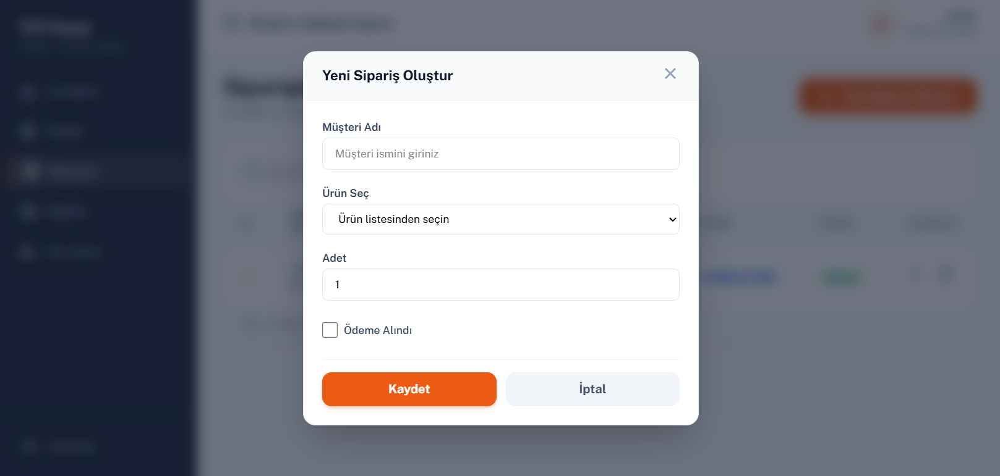
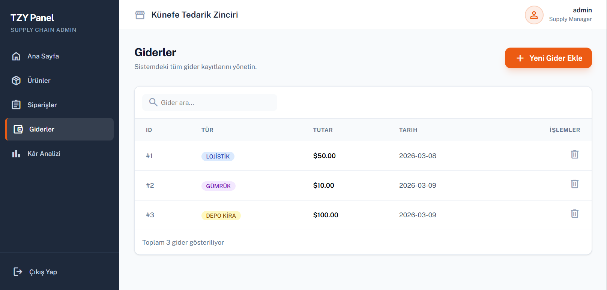
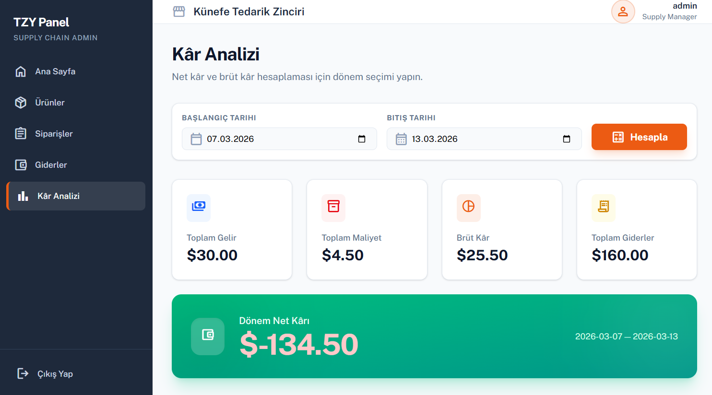

# TZY Panel - Künefe Tedarik Zinciri Yönetim Sistemi

Türkiye'den ABD'ye dondurulmuş künefe ithal eden ve ABD içindeki restoran zincirlerine satan bir işletmenin operasyonlarını yönetmek için geliştirilmiş B2B Tedarik Zinciri Yönetim Sistemi.

## Proje Hakkında

Bu sistem; stok takibi, peşin satış operasyonu ve işletme kârlılığının analizini tek bir admin panelinden yönetmeyi sağlar. Türkiye'deki üretim tesisinden çıkan ürünlerin ABD deposuna girişi, oradan son müşteriye satışı ve tüm finansal süreçleri kapsar.

## Teknolojiler

### Backend
- Java 17 / Spring Boot 3.5
- PostgreSQL
- Spring Data JPA
- Spring Security + JWT
- Maven

### Frontend
- React 18 / Vite
- Tailwind CSS v4
- Axios
- React Router DOM

## Mimari
```
tzy-backend/
└── src/main/java/com/tzy/
    ├── controllers/    → HTTP isteklerini karşılar
    ├── services/       → İş kuralları burada uygulanır
    ├── repos/          → Veritabanı işlemleri
    ├── entities/       → Veritabanı tabloları
    ├── dtos/
    │   ├── requests/   → Gelen veriler
    │   └── responses/  → Giden veriler
    └── securities/     → JWT ve Spring Security yapılandırması

tzy-frontend/
└── src/
    ├── api/            → Axios yapılandırması
    ├── components/     → Layout ve ortak bileşenler
    └── pages/          → Uygulama sayfaları
```

> **Not:** Lombok kullanılmamıştır. Tüm POJO sınıflarında Constructor, Getter ve Setter metodları manuel yazılmıştır.

## Özellikler

- JWT tabanlı kimlik doğrulama ve rol yönetimi
- Ürün yönetimi ve stok takibi
- Peşin satış sistemi — ödeme alınmadan sipariş oluşturulamaz
- Sipariş statü takibi: HAZIRLANIYOR → YOLDA → TESLİM EDİLDİ
- Manuel gider girişi (Lojistik, Gümrük, Depo Kira, Diğer)
- Tarih bazlı kâr analizi (Brüt Kâr / Net Kâr)

## İş Kuralları

- **Peşin Satış:** Ödeme alınmadan sipariş oluşturulamaz
- **Stok Entegrasyonu:** Sipariş onaylandığında stok otomatik düşer, sipariş iptalinde iade edilir
- **Statü Akışı:** Statüler sadece ileri gidebilir, geri alınamaz
- **Kâr Hesabı:**
  - Brüt Kâr = (Satış Adedi × Satış Fiyatı) - (Satış Adedi × Alış Maliyeti)
  - Net Kâr = Brüt Kâr - Toplam Giderler

## Kurulum

### Gereksinimler
- Java 17+
- Node.js 18+
- PostgreSQL

### Backend

1. PostgreSQL'de veritabanı oluştur
```sql
CREATE DATABASE db_tzy;
```

2. `application.properties.example` dosyasını kopyala
```bash
cp application.properties.example application.properties
```

3. `application.properties` içindeki değerleri düzenle

4. Uygulamayı başlat
```bash
cd tzy-backend
mvn spring-boot:run
```

### Frontend

1. Bağımlılıkları yükle ve başlat
```bash
cd tzy-frontend
npm install
npm run dev
```

2. Tarayıcıda aç: `http://localhost:5173`

## API Endpoints

### Auth
| Method | Endpoint | Açıklama |
|--------|----------|----------|
| POST | /api/auth/login | Giriş yap, JWT token al |

### Ürünler
| Method | Endpoint | Açıklama |
|--------|----------|----------|
| GET | /api/products | Tüm ürünleri listele |
| GET | /api/products/{id} | Tek ürün getir |
| POST | /api/products | Yeni ürün ekle |
| PUT | /api/products/{id} | Ürün güncelle |
| DELETE | /api/products/{id} | Ürün sil |

### Siparişler
| Method | Endpoint | Açıklama |
|--------|----------|----------|
| GET | /api/orders | Tüm siparişleri listele |
| GET | /api/orders/{id} | Tek sipariş getir |
| POST | /api/orders | Yeni sipariş oluştur |
| PUT | /api/orders/{id}/status | Sipariş statüsü güncelle |
| DELETE | /api/orders/{id} | Sipariş sil |

### Giderler & Kâr Analizi
| Method | Endpoint | Açıklama |
|--------|----------|----------|
| GET | /api/expenses | Tüm giderleri listele |
| POST | /api/expenses | Yeni gider ekle |
| DELETE | /api/expenses/{id} | Gider sil |
| GET | /api/expenses/profit?start=YYYY-MM-DD&end=YYYY-MM-DD | Kâr analizi |

## Ekran Görüntüleri

### Login


### Dashboard


### Ürünler




### Siparişler




### Giderler


### Kâr Analizi

